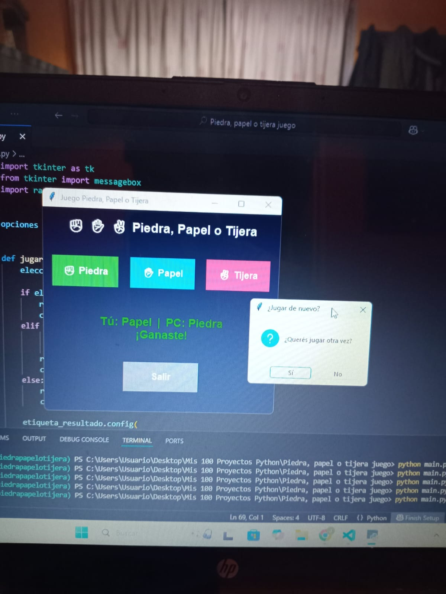
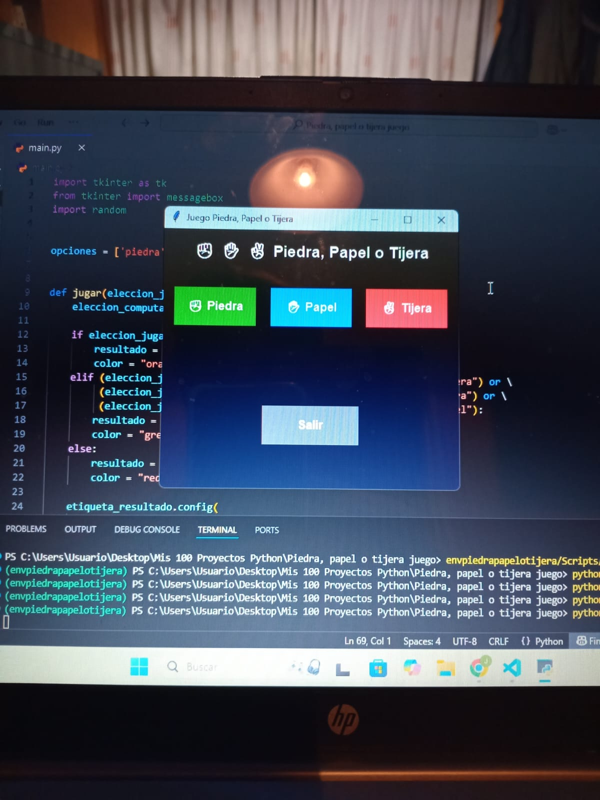
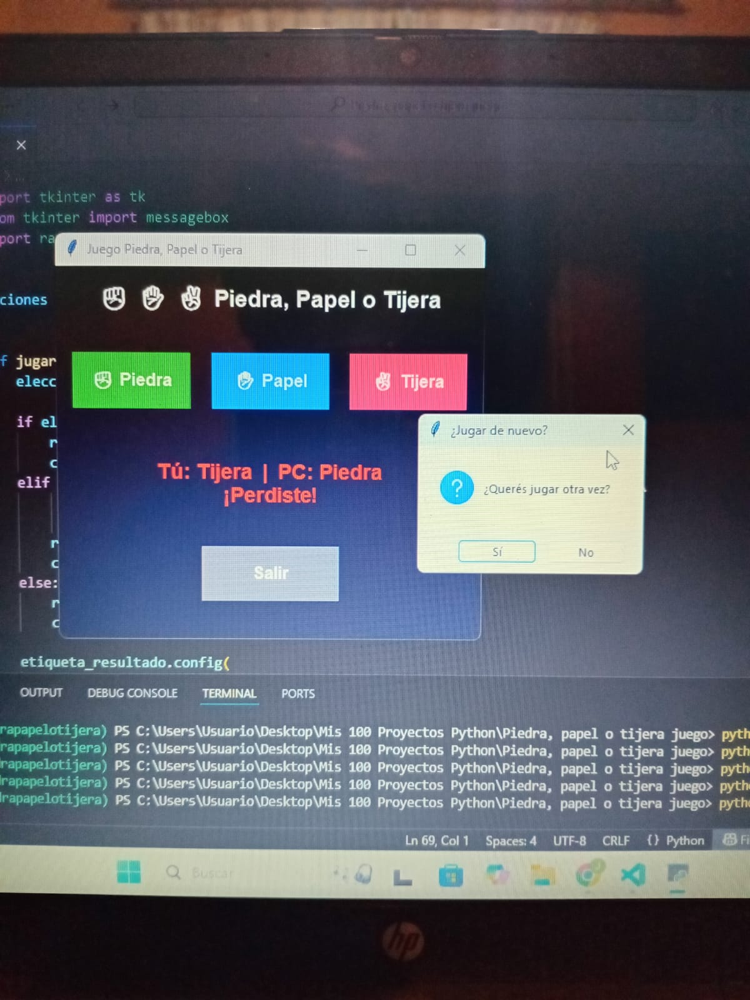

# 🎮 Rock Paper Scissors (Tkinter + Python)

This project is a **Rock, Paper, Scissors game** created with **Python** and **Tkinter**.  
It features a modern graphical interface with colors, emojis, and restart logic that asks the player if they want to play again.

---

## 📌 Features
- ✨ Simple and modern **GUI** with colors and emojis.
- 🔘 Choose your move with interactive buttons.
- 🤖 Computer plays randomly.
- 🔄 After each match, the game asks if you want to play again.
- 🚪 Exit button included.

---

## 📷 Screenshots

Here are some screenshots of the game:

  
  
  

---

## 🛠️ Requirements

Make sure you have Python installed.  
Dependencies:
- `tkinter` (comes with Python standard library)
- `random` (built-in)

---

## ▶️ Run the game

Clone the repository and run:

```bash
python main.py
